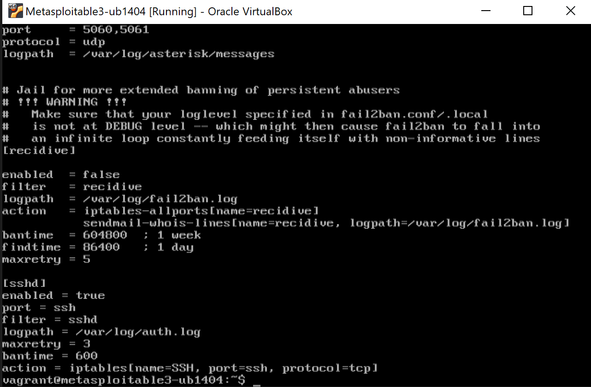
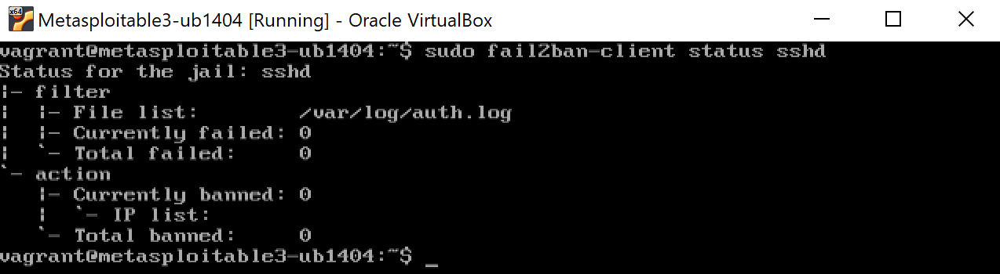

# Phase #3 – Defensive Strategy Implementation with Fail2Ban

##  Objective

Defend against SSH brute-force login attacks on Metasploitable3 by configuring Fail2Ban to automatically ban IP addresses after repeated failed login attempts.


##  Defense Tool Used: Fail2Ban

* **Monitored Log File:** `/var/log/auth.log`
* **Attacker Machine:** Kali Linux
* **Victim Machine:** Metasploitable3


##  Steps Taken to Apply and Test the Defense

### 1. Configure Fail2Ban on the Victim (Metasploitable3)

* Opened the jail configuration file:

```bash
sudo nano /etc/fail2ban/jail.local
```

* Added the following config under `[sshd]`:

```ini
[sshd]
enabled = true
port = ssh
filter = sshd
logpath = /var/log/auth.log
maxretry = 3
bantime = 600
action = iptables[name=SSH, port=ssh, protocol=tcp]
```

* Restarted Fail2Ban:

```bash
sudo service fail2ban restart
```

** Screenshot – jail.local configuration:**



### 2. Trigger Brute-Force Attack from Kali Linux

* Launched repeated SSH login attempts:

```bash
ssh msfadmin@192.168.56.103
```

* Repeated incorrect logins until the server refused further connections:

```
Permission denied
Connection refused
```

** Screenshot – SSH brute-force blocked:**



### 3. Verify that the Attack Was Blocked

* Checked Fail2Ban status to confirm the ban:

```bash
sudo fail2ban-client status sshd
```

** Screenshot – Banned IP listed:**


* Viewed auth log for failed login attempts:

```bash
sudo tail -n 15 /var/log/auth.log
```

** Screenshot – Auth log with failures:**


##  Environment Setup

**Metasploitable3 (Victim)**

* IP: `192.168.56.103`
* Username: `vagrant`

**Kali Linux (Attacker)**

* IP: `192.168.56.104`
* Username: `kali`


##  Conclusion

Fail2Ban successfully mitigated an SSH brute-force attack by:

* Monitoring `/var/log/auth.log`
* Detecting multiple failed login attempts (threshold: 3)
* Banning the attacker's IP using `iptables`

The block was confirmed via `fail2ban-client` output, `auth.log` entries, and SSH connection refusal on the attacker side.

This demonstrates an effective host-based defense that requires minimal overhead and protects exposed SSH services.
