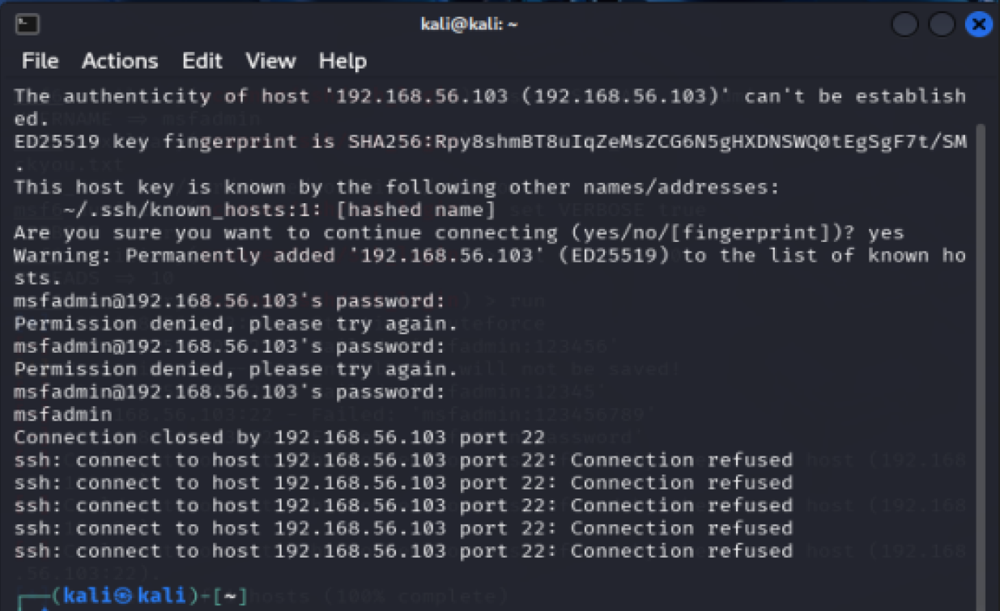

Phase #3 – Defensive Strategy Proposal

Objective:
Apply a security defense mechanism to mitigate the exploited SSH brute-force vulnerability, and validate that the defense effectively prevents future exploitation attempts.

Defense Tool: Fail2Ban
Targeted Service: SSH
Defense Type: Intrusion Prevention - Automated IP banning after failed login attempts.

Steps Taken to Implement the Defense:

1. Install Fail2Ban on the Metasploitable3 (Victim Machine):

sudo apt update
sudo apt install fail2ban

2. Configure Fail2Ban to protect SSH service:

    Copied the default jail configuration:

    sudo cp /etc/fail2ban/jail.conf /etc/fail2ban/jail.local

    Edited the jail.local file:

    sudo nano /etc/fail2ban/jail.local

    Added/Modified the [sshd] section:

    [sshd]
    enabled = true
    port = ssh
    filter = sshd
    logpath = /var/log/auth.log
    maxretry = 3
    bantime = 600

3. Restart Fail2Ban to apply the new configuration:

sudo service fail2ban restart

4. Verify Fail2Ban status for SSH protection:

sudo fail2ban-client status sshd

Environment Setup
Machine	Details
Metasploitable3 (Victim)	
- NAT IP Address	10.0.2.15
- Host-Only Adapter IP	192.168.56.102
- Username	vagrant
- Password	vagrant
Kali Linux (Attacker)	
- Hostname	kali
- Username	kali
- Password	kali
- Host-Only Adapter IP	192.168.56.101

Testing the Defense
1. Connectivity Check:
Result of pinging the Metasploitable3 machine from the Kali attacker machine:

2. Before the Attack: SSH Jail Status
Verified that Fail2Ban was monitoring the SSH service, with no banned IPs yet.

3. Simulating a Brute-Force Attack
Used SSH from the Kali machine.
Entered the wrong password three times intentionally.
The SSH connection was forcefully closed after the 3rd wrong attempt, indicating defense activation.

4. After the Attack: SSH Jail Status
Verified that the attacker's IP address was banned automatically by Fail2Ban.

Conclusion
Fail2Ban successfully protected the Metasploitable3 server from brute-force SSH login attempts. After three incorrect login attempts, the attacker's IP address was automatically banned for a configured duration (10 minutes), effectively mitigating the attack vector.